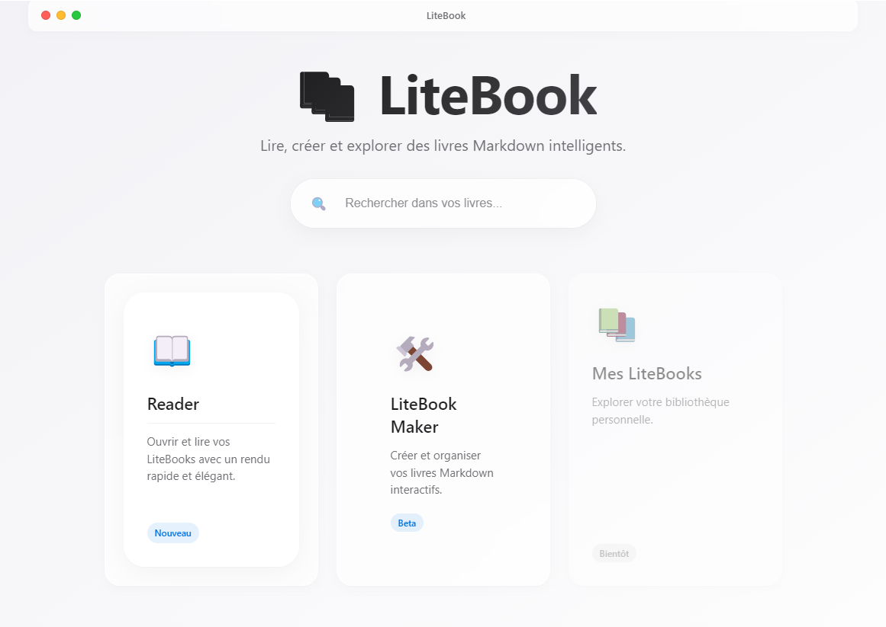

# LiteBook


LiteBook — a lightweight Markdown book engine to read, create and distribute portable .litebook books.

The project provides a complete environment for working with Markdown-based books, including a reader, an editor, and a portable archive format. LiteBook focuses on simplicity, readability, and long-term maintainability of written content.

---

# Overview

LiteBook is built around the idea that books and documentation should remain simple, transparent, and portable.

Instead of relying on complex proprietary formats, LiteBook uses:

* Markdown for content
* a simple folder structure
* JSON configuration files
* a lightweight rendering engine

This makes LiteBook suitable for documentation, educational material, technical manuals, and knowledge bases.

---

# Features

## Markdown Reader

LiteBook provides a fast Markdown rendering engine capable of displaying structured documents clearly and efficiently.

Supported elements include:

* headings and sections
* lists and nested lists
* code blocks
* quotes
* images
* diagrams
* mathematical expressions through plugins

The reader interface is designed to minimize distractions and focus on readability.

---

## LiteBook Maker

LiteBook includes an editor environment that allows users to create and organize books.

The maker interface allows users to:

* create a new LiteBook project
* manage chapters
* edit Markdown content
* organize book structure
* prepare books for distribution

This makes it possible to create complete books without external tooling.

---

## Portable Book Format

LiteBook introduces a simple portable format based on folders with the `.litebook` extension.

Each LiteBook is a self-contained directory containing:

* book metadata
* Markdown chapters
* assets such as images or diagrams
* optional AI configuration

Because it is folder-based, the format works well with version control systems such as Git.

---

## Extensible Rendering Engine

The rendering engine is modular and supports plugins.

Available plugins include:

* syntax highlighting
* diagrams
* mathematical rendering

The engine is designed to be easily extended with new plugins.

---

## AI Integration

LiteBook allows optional integration with artificial intelligence features.

These capabilities can be defined in configuration files such as:

```
ai/skills.json
```

Possible use cases include:

* chapter summarization
* quiz generation
* semantic search
* knowledge extraction

AI features are optional and designed to integrate without affecting the base book format.

---

# LiteBook Format

A LiteBook is simply a directory with a defined structure.

Example:

```
my-book.litebook
│
├ book.json
├ chapters
│   ├ intro.md
│   ├ installation.md
│   └ architecture.md
│
├ assets
│   ├ images
│   └ diagrams
│
└ ai
    └ skills.json
```

The `book.json` file defines metadata and the table of contents.

Example:

```
{
  "title": "My Book",
  "author": "Author Name",
  "toc": [
    { "title": "Introduction", "file": "chapters/intro.md" },
    { "title": "Installation", "file": "chapters/installation.md" }
  ]
}
```

---

# Architecture

The project is structured to separate the rendering engine, application features, and user interface.

```
src
│
├ engine
│   ├ core
│   └ plugins
│
├ features
│   ├ reader
│   ├ maker
│   └ archive
│
├ services
│
└ ui
```

## Engine

The engine is responsible for Markdown processing and plugin execution.

Core modules include:

* markdown engine
* book loader
* link resolver

Plugins extend the rendering system.

## Features

Features provide the main capabilities of the application:

* Reader
* Maker
* Archive management

## Services

Services provide additional capabilities such as:

* book management
* AI services

## UI

The UI layer is implemented with Vue and provides the application interface.

---

# Technology Stack

LiteBook is built using the following technologies:

* Electron for the desktop application
* Vue.js for the user interface
* Vite for development and bundling
* Node.js for system integration
* Markdown for content format

---

# Installation

Clone the repository:

```
git clone https://github.com/yourusername/litebook.git
```

Move into the project directory:

```
cd litebook
```

Install dependencies:

```
npm install
```

Run the development environment:

```
npm run dev
```

This will start the development server and launch the Electron application.

---

# Development

The development workflow uses Vite for the frontend and Electron for the desktop environment.

Typical development steps include:

1. running the development server
2. editing Vue components
3. modifying engine plugins
4. testing LiteBook files

Because LiteBook uses a simple folder format, books can be edited directly with any text editor.

---

# Use Cases

LiteBook can be used for a wide range of content:

* technical documentation
* programming tutorials
* academic material
* training courses
* knowledge bases
* technical manuals

The format is particularly suitable for projects that require structured documentation with version control.

---

# Roadmap

Future development may include:

* improved editor capabilities
* plugin marketplace
* enhanced AI tools
* collaborative editing
* online LiteBook viewer
* advanced search and indexing

---

# License

This project is licensed under the MIT License.

Permission is hereby granted, free of charge, to any person obtaining a copy of this software and associated documentation files to deal in the software without restriction, including without limitation the rights to use, copy, modify, merge, publish, distribute, sublicense, and/or sell copies of the software.

See the LICENSE file for more details.
